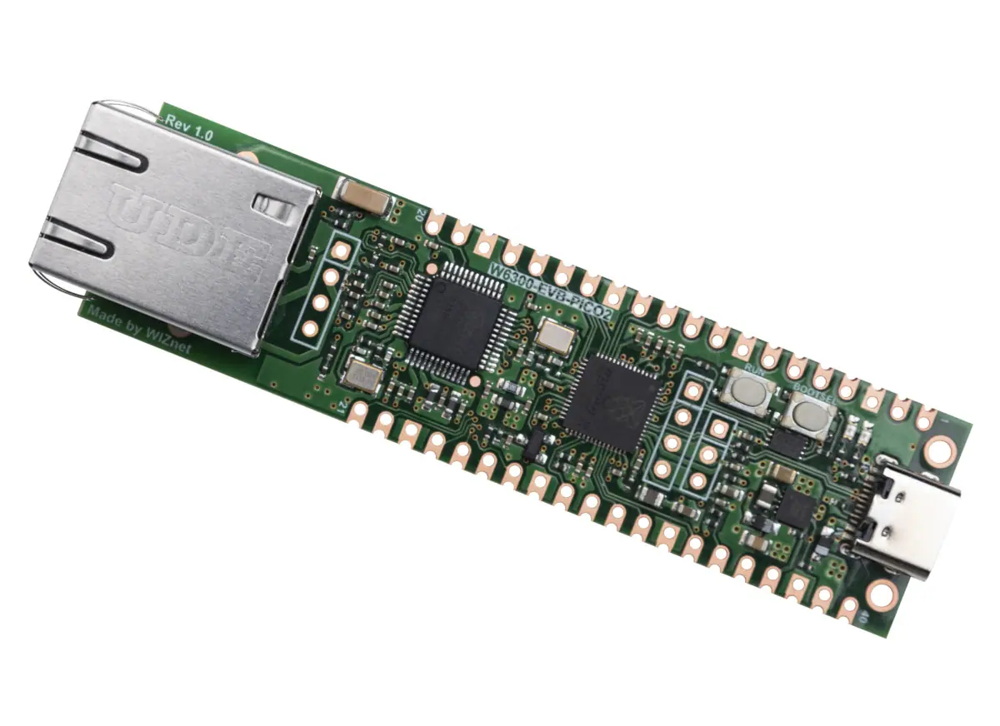
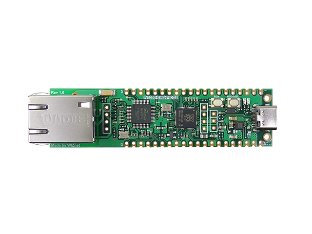
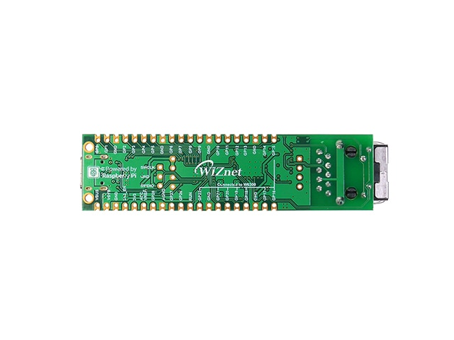
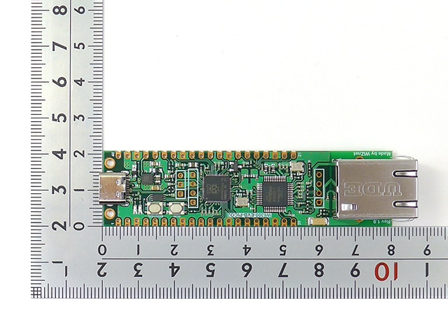
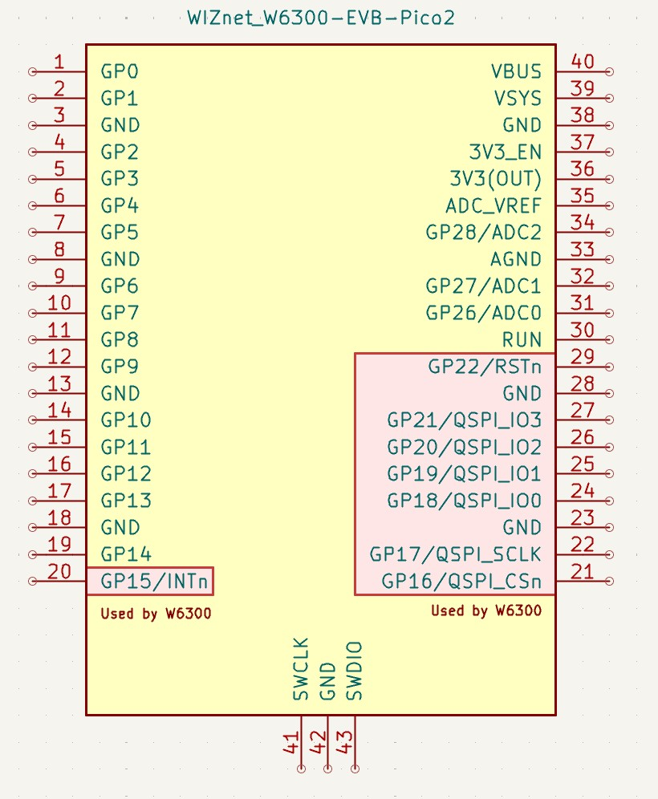
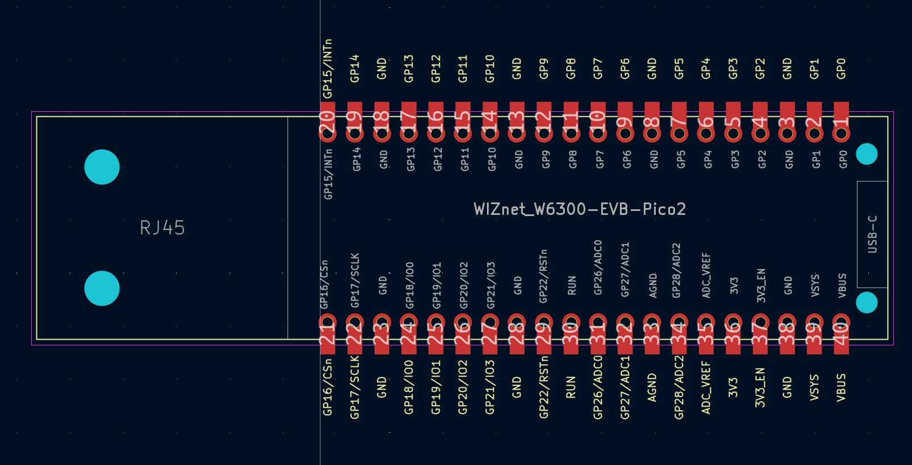

# KiCad Symbol and Footprint for the WIZnet W6300-EVB-Pico2

> [!NOTE]
> También disponible en [español](README.es.md).

<table>
  <tr>
    <td></td>
    <td></td>
  </tr>
  <tr>
    <td></td>
    <td></td>
  </tr>
</table>

This repository contains a KiCad symbol, footprint and 3D model for the [WIZnet W6300-EVB-Pico2](https://docs.wiznet.io/Product/Chip/Ethernet/W6300/w6300-evb-pico2) — an RP2350 board with the W6300 10/100 Ethernet controller wired over QSPI, packaged in the Raspberry Pi Pico 2 form factor and extended on one short edge with an integrated RJ45 magjack. The board measures 80 × 21 mm.

The KiCad symbol exposes the 40-pin Pico 2 header plus the three SWD test points, with combined labels (`GP18/QSPI_IO0`, `GP22/RSTn`, etc.) on the eight pins that the W6300 occupies internally. The footprint is a 2×20 through-hole header at 2.54 mm pitch with castellated keyhole pads, so the module can be mounted either through a 2.54 mm pin header or surface-mounted directly onto a carrier PCB.

<table>
  <tr>
    <td width="40%" align="center"></td>
    <td width="60%" align="center"></td>
  </tr>
</table>

## Installing this library

First, clone or download this repository.

Add the symbol and footprint libraries to KiCad:

- **Preferences → Manage Symbol Libraries…** and add `kicad/WIZnet_W6300-EVB-Pico2.kicad_sym`
- **Preferences → Manage Footprint Libraries…** and add the `kicad/WIZnet_W6300-EVB-Pico2.pretty/` folder

So that the 3D model resolves, define a path variable in KiCad:

- **Preferences → Configure Paths…**
- Add an entry with name `WIZNET_W6300_LIB` and value pointing to the `kicad/` folder of the cloned repository
